# Flowchart Chatbot RAG
## Diagram Alur Sistem

---

## 1. Flowchart Utama - Alur Chat

---

## 2. Flowchart Hybrid Retrieval

---

## 3. Flowchart Ingestion PDF

```mermaid
flowchart TD
    A[📄 Upload PDF] --> B[Ekstraksi Teks]
    B --> C[Chunking ~500 karakter]
    C --> D[Embedding via Ollama]
    D --> E[Simpan ke Qdrant]
    E --> F[✅ PDF Siap Digunakan]
    
    subgraph Metadata
        M1[source_file]
        M2[chunk_index]
        M3[text]
        M4[vector 768d]
    end
    
    E --> Metadata
```

---

## 4. Flowchart Anti-Halusinasi

```mermaid
flowchart TD
    A[Pertanyaan User] --> B{Topik Kampus?}
    
    B -->|Tidak| C["❌ Maaf, topik di luar konteks"]
    B -->|Ya| D[Retrieval]
    
    D --> E{Ada Chunk Relevan?}
    
    E -->|Tidak| F["❌ Tidak ditemukan informasi"]
    E -->|Ya| G[Generate Jawaban]
    
    G --> H{Ada Sitasi?}
    
    H -->|Tidak| I[Retry dengan prompt ketat]
    H -->|Ya| J["✅ Jawaban + [#N]"]
    
    I --> G
```

---

## 5. Flowchart Multi-hop Query Decomposition

---

## 6. Flowchart Arsitektur Sistem

---

## 7. Sequence Diagram - Alur Chat

---

## Cara Menggunakan Diagram

1. **Mermaid Live Editor**: Copy kode ke [mermaid.live](https://mermaid.live)
2. **VS Code**: Install extension "Mermaid Preview"
3. **GitHub**: Otomatis render di file .md
4. **Export**: Bisa export ke PNG/SVG dari Mermaid Live

---

*Dokumen ini dibuat untuk keperluan presentasi skripsi*  
*Terakhir diperbarui: 4 Januari 2026*
